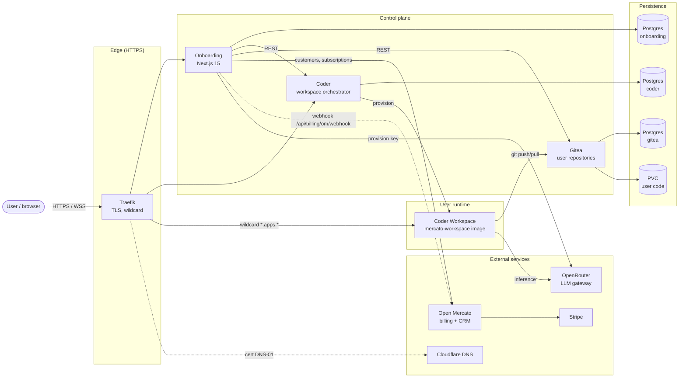
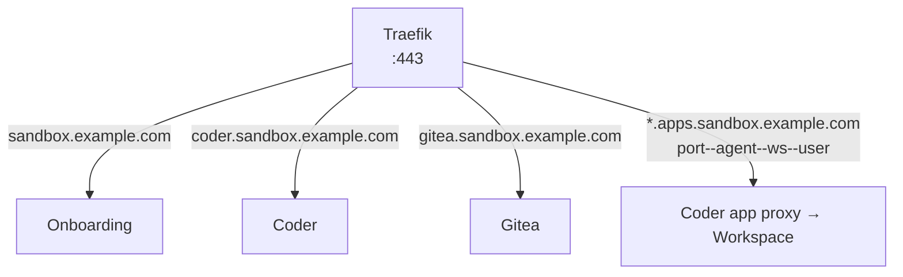
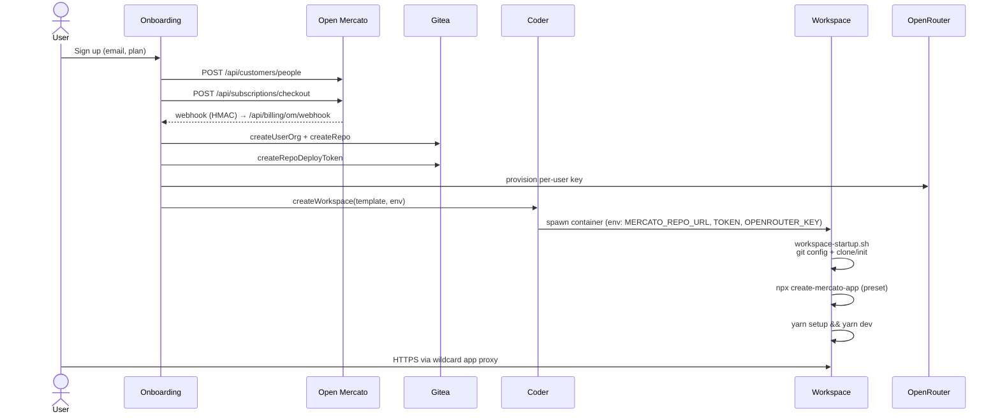
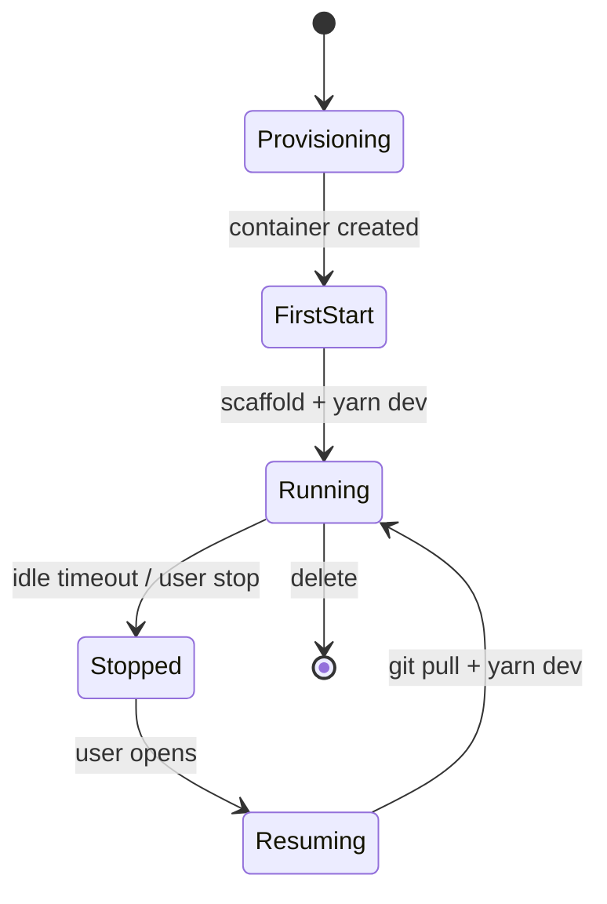
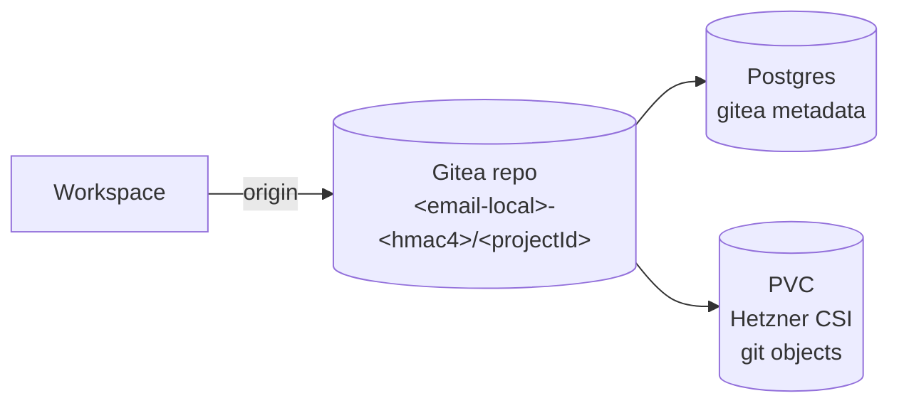
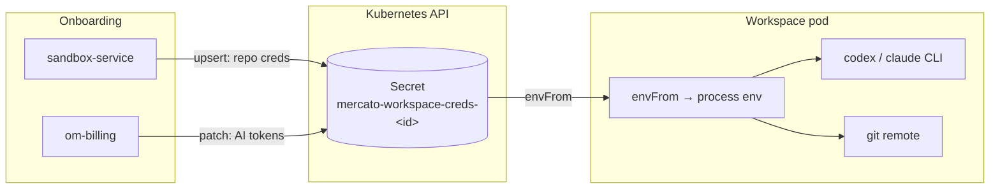
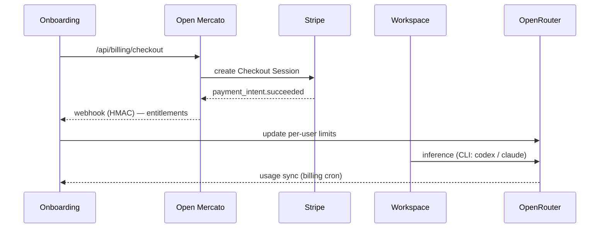

# System Architecture — Mercato Sandboxes

Reference document: components, responsibility boundaries, and data flows.

---

## 1. High-level view

---

## 2. Components

| Component | Role | Tech | Location |
|---|---|---|---|
| **onboarding** | Signup, dashboard, sandbox provisioning, billing integration | Next.js 15, Postgres 17 | `apps/onboarding` |
| **crm** (OM module) | Customer profile synced with OM | — | `apps/crm` |
| **Coder** | Workspace orchestration, wildcard app proxy | Coder OSS | `infra/helm/values/coder.yaml` |
| **mercato-workspace** | Runtime image: code-server, Node 24, yarn, opencode, codex, claude CLI | Docker image | `coder/workspace-image/Dockerfile` |
| **Gitea** | Backing repository for user code (only option) | Gitea + Postgres | `infra/helm/values/gitea.yaml` |
| **Traefik** | Single ingress, TLS, wildcard routing | Traefik | `infra/hetzner-k3s/manifests/traefik/` |
| **Open Mercato** | Source of truth for billing / subscriptions / CRM | Next.js app | `infra/helm/charts/openmercato` |
| **PostgreSQL (×3)** | State: onboarding / coder / gitea | Postgres 17 | per-service PVC (Hetzner CSI) |

External services: **OpenRouter** (LLM), **Stripe** (via OM), **Cloudflare** (DNS-01 for wildcard cert), **Hetzner** (k3s + CSI + LB).

---

## 3. Routing (single edge, wildcard)

Wildcard format: `{port}--{agent}--{workspace}--{user}.apps.<domain>`. WebSocket/HTTP1.1 preserved for PTY and terminal traffic.

---

## 4. Flow: signup → running sandbox

---

## 5. Workspace lifecycle

**Bootstrap** (`coder/template/files/workspace-startup.sh.tftpl`):
- first start: `git config` as `mercato-agent`, `create-mercato-app`, `yarn setup`, `yarn dev`
- subsequent starts: `git pull`, `yarn dev`
- ports: app `:3000`, splash `:4000`, code-server `:13337`

---

## 6. User code persistence

**Rules**:
- Each user gets a backing Gitea **user** (not org — namespaces are shared) named `<email-local>-<hmac4>` (e.g. `john-a3f2`), deterministic per `userId`.
- Sandbox repo name = sanitized `projectId`; full path `<owner>/<projectId>`.
- Deploy token scope `write:repository`, minted per-repo and injected into workspace by Coder as env var.
- All PVCs on **Hetzner CSI** (not Longhorn).
- HTTP-only access (SSH disabled).

---

## 7. Per-workspace secrets

Each sandbox has a dedicated Kubernetes Secret `mercato-workspace-creds-<sandboxId>` in the `mercato-sandboxes` namespace, mounted into the workspace pod via `envFrom`. Onboarding creates/patches/deletes it directly through the Kubernetes API using its in-cluster ServiceAccount.

| Key | Source | Used by |
|---|---|---|
| `MERCATO_REPO_URL` | Gitea clone URL | `git` in workspace |
| `MERCATO_REPO_TOKEN` | Gitea per-repo deploy token (`write:repository`) | `git` push/pull |
| `MERCATO_GH_USER_NAME` | committer name (optional) | `git config` |
| `MERCATO_GH_USER_EMAIL` | committer email (optional) | `git config` |
| `OPENROUTER_API_KEY` | per-user OpenRouter key | `codex`, `claude` CLI |
| `ANTHROPIC_AUTH_TOKEN` | mirrors OpenRouter key (or override) | `claude` CLI |

**Lifecycle**:
- Repo credentials written by `sandbox-service` on sandbox create (`upsertWorkspaceCredsSecret`, see [`apps/onboarding/lib/k8s/workspace-secrets.ts`](../../apps/onboarding/lib/k8s/workspace-secrets.ts)).
- AI tokens patched in by `om-billing` after a successful Open Mercato entitlement webhook — same Secret, separate keys.
- Secret deleted with the sandbox; tokens revoked on Gitea / OpenRouter side.

---

## 8. Billing & entitlements

Open Mercato is the source of truth for subscriptions. Onboarding never talks to Stripe directly.

---

## 9. Infrastructure

- **Platform**: k3s on Hetzner Cloud, provisioned via OpenTofu (`infra/hetzner-k3s/`).
- **TLS**: Let's Encrypt + Cloudflare DNS-01 for wildcard certs.
- **Storage**: Hetzner CSI volumes for every stateful component.
- **Deployments**: Helm releases from `infra/helm/values/` (onboarding, coder, services-bootstrap, gitea, openmercato).

---

## 10. Key files

**Specs**: [`.ai/SPEC.md`](../SPEC.md), [`.ai/SPEC-CODER-PROXY.md`](../SPEC-CODER-PROXY.md), [`.ai/SPEC-PROD.md`](../SPEC-PROD.md), [`.ai/SPEC-OPENROUTER-ONBOARDING.md`](../SPEC-OPENROUTER-ONBOARDING.md)

**Infra**: [`infra/USER-CODE-PERSISTENCE-PLAN.md`](../../infra/USER-CODE-PERSISTENCE-PLAN.md), [`infra/hetzner-k3s/README.md`](../../infra/hetzner-k3s/README.md), [`infra/helm/README.md`](../../infra/helm/README.md), [`.ai/docs/cluster_provisioning.md`](cluster_provisioning.md)

**Code**:
- [`apps/onboarding/lib/coder.ts`](../../apps/onboarding/lib/coder.ts) — Coder API
- [`apps/onboarding/lib/gitea/client.ts`](../../apps/onboarding/lib/gitea/client.ts) — Gitea API
- [`apps/onboarding/lib/sandbox-service.ts`](../../apps/onboarding/lib/sandbox-service.ts) — provisioning orchestration
- [`coder/template/main.tf`](../../coder/template/main.tf) — workspace template
- [`coder/template/files/workspace-startup.sh.tftpl`](../../coder/template/files/workspace-startup.sh.tftpl) — agent bootstrap
- [`coder/workspace-image/Dockerfile`](../../coder/workspace-image/Dockerfile) — runtime image
